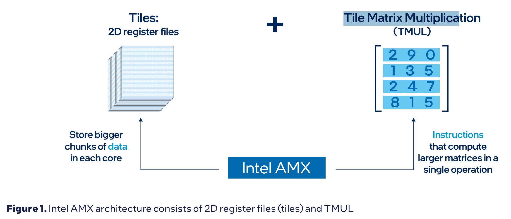

# Intel AMX

## 1. Intel AMX架构

包含了两个基础的组件:

* Tile(翻译成矩阵块比较合适), 包含了**8**个二维寄存器(TMM0...TMM7), 每个1KB, 可以存储一块数据
* Tile Matrix Multiplication (TMUL, 块矩阵乘法器), 进行矩阵乘法, 这里的矩阵乘法对乘法和加法进行了算子融合



AMX支持INT8和BF16两种数据类型:

* INT主要针对推理
* BF16主要针对训练

## 2. 计算逻辑

使用Intel AMX的计算逻辑如下:

* 系统调用请求AMX

* 初始化tilecnf
* 从memory中加载到指定tile
* 在tile中进行矩阵计算*+
* 从tile存储还原到memory
* release资源

## 3. 指令集

1. `void __tile_cmmimfp16ps (__tile1024i* dst, __tile1024i src0, __tile1024i src1)`

   1. 复数矩阵运算, 得到计算结果的虚部
   2. Tile src0和src1的每个dword被解释为FP16的实部和虚部 (dword表示32bit)
   3. 输出是单精度FP32的dst tile

2. `void _tile_cmmimfp16ps (constexpr int dst, constexpr int a, constexpr int b)`

   1. 同上面一样, 但是这里用的是tile id

3. `void __tile_cmmrlfp16ps (__tile1024i* dst, __tile1024i src0, __tile1024i src1)`

   1. 同上面一样但是计算的是实部

4. `void _tile_cmmrlfp16ps (constexpr int dst, constexpr int a, constexpr int b)`

   1. 同上, 使用tile id计算实部

5. `void __tile_dpbf16ps (__tile1024i* dst, __tile1024i src0, __tile1024i src1)`

   1. 计算dot product, src0和src1都是bfloat16, 累加中间结果到单精度的dst中
   2. 这里本质上就是矩阵乘法

6. `void _tile_dpbf16ps (constexpr int dst, constexpr int a, constexpr int b)`

   1. 采用tile id的版本

7. `void __tile_dpbssd (__tile1024i* dst, __tile1024i src0, __tile1024i src1)`

   1. 这里src是Signed INT8, 保存的结果是int32, 操作如上

8. `void __tile_dpbsud (__tile1024i* dst, __tile1024i src0, __tile1024i src1)`

   1. signed <--> unsigned 8位INT操作

9. 后面就是ss, su, us, uu, 本质上是不同符号类型的对比计算

10. `void _tile_loadconfig (const void * mem_addr)`

    1. Load tile configuration from a 64-byte memory location specified by mem_addr. The tile configuration format is specified below, and includes the tile type pallette, the number of bytes per row, and the number of rows. If the specified pallette_id is zero, that signifies the init state for both the tile config and the tile data, and the tiles are zeroed. Any invalid configurations will result in #GP fault.

    2. ```c
       //	format of memory payload. each field is a byte.
       //		 0: palette
       //		 1: start_row
       //	 2-15: reserved, must be zero
       //	16-17: tile0.colsb
       //	18-19: tile1.colsb
       //	20-21: tile2.colsb
       //			...
       //	30-31: tile7.colsb
       //	32-47: reserved, must be zero
       //		48: tile0.rows
       //		49: tile1.rows
       //		50: tile2.rows
       //			 ...
       //		55: tile7.rows
       //	56-63: reserved, must be zero
       ```

11. `void __tile_loadd (__tile1024i* dst, const void* base, size_t stride)`

    1. 按照一定的stride从base中载入数据到dst中

12. `void _tile_release ()`

    1. 释放资源和数据

13. `void _tile_storeconfig (void * mem_addr)`

    1. 保存tile的configuration

14. `void __tile_stored (void* base, size_t stride, __tile1024i src)`

    1. 将tile中的数据保存到base中

15. `void __tile_stream_loadd (__tile1024i* dst, const void* base, size_t stride)`

    1. 也是载入数据, 但是表明不会立马使用

16. `void __tile_zero (__tile1024i* dst)`

    1. 归零

没搞懂:

*  Two palettes are supported; palette 0 represents the initialized state, and palette 1 consists of 8  KB of storage spread across 8 tile registers named TMM0..TMM7.
* 每个Tile最大的Size是16行 X 64 bytes (1KB), 通过colsb参数能够控制实际使用tile的大小.
* The TMUL instruction set (defined to be CPUID bits AMX-BF16 and AMX-INT8) only  supports reg-reg operations. (TMUL指令只能实现reg-reg的操作)
* TMUL instruction set compute `C[M][N] += A[M][K] * B[K][N]`